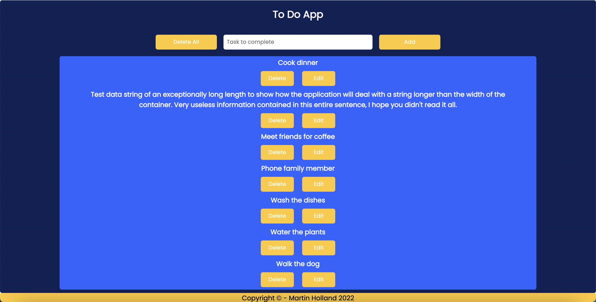

# Typescript Todo App

A basic typescript app written with classes and interfaces for the purpose of demonstrating some of the key strengths of Typescript.

## Technologies used

Built with:

- HTML
- Typescript
- CSS
- Lite Server
- Node

## Setup and usage

Step 1) Clone the repository

Step 2) npm install

```shell
npm install
```

Step 3) npm start

```shell
npm start
```

### (Optional for Debugging and altering code)

If editing the code in this project then you will need to first start tsc in watch mode.
This assumes that you have Typescript Compiler installed in your system. The tsconfig is already set up.

```shell
tsc -w
```

## Screenshot



## Sources

- [GitHub Guides - masterin markdown](https://guides.github.com/features/mastering-markdown/)
- [Make a README](https://www.makeareadme.com/)

## Authors and acknowledgment

Margit Tennosaar

- GitHub @margittennosaar
- [LinkedIn](https://www.linkedin.com/in/margittennosaar/)
